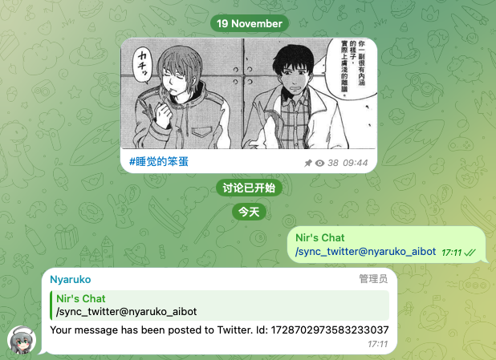
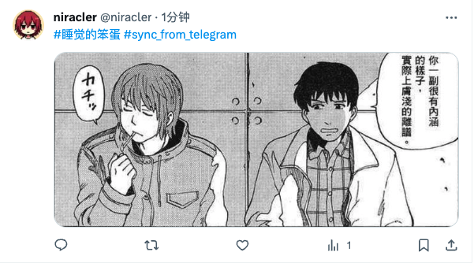

# Nyaruko Telegram Bot

[English](README.md) | [简体中文](README.cn.md)

Welcome to the exotic Nyaruko Telegram Bot project! 🌟 This one-of-a-kind Telegram bot is deployed on the high-performance Cloudflare Workers. Nyaruko is not just any bot, but a sprite companion for Niracler, always ready to execute whimsical and unique tasks. Inspired by the leading character Nyaruko from "Haiyore! Nyaruko-san" and rooted in the Lovecraftian Mythos, our bot brings surprises and quirky fun at every corner! 👾

## Feature Introduction

Currently, Nyaruko has the following stunning features:

### `/sync_twitter` - Synchronize Telegram messages to Twitter

With the `/sync_twitter` command, Nyaruko can synchronize messages from Telegram to Twitter. Let your thoughts take flight and soar into another social media realm. 🕊️ However, Nyaruko is still growing and currently does not support hyperlinks or handle Telegram's `media_group`. Cleverly caching history in Cloudflare is needed, and it is believed that Nyaruko will soon learn this new skill! 🎓

for more details, see [here](https://github.com/niracler/nyaruko-telegram-bot/pull/2), there are more complete examples.

<div align=center>
  
  
</div>

### All Features list

- `/sync_twitter` - Sync msg to Twitter.
- `/ping` - Test if the bot is online.
- `/getchatid` - Get the ID of the current chat.
- `/getuserid` - Get the ID of the current user.
- `/ny` - Interact with Nyaruko.

### More features coming soon

The capabilities of Nyaruko are continuously evolving, and more exciting features will be launched in the future.

## How to Run Nyaruko

To get Nyaruko up and running in your environment, please follow these steps:

1. Prepare your Cloudflare Workers environment.
2. Configure the necessary environment variables using the `wrangler secret` command to set them.
3. Deploy the Nyaruko bot to Cloudflare Workers.

### Necessary Environment Variables

Nyaruko requires the following environment variables to function:

- `ALLOWED_USER_IDS`: The comma-separated list of user IDs allowed to use the bot. This is set in `wrangler.yml` and does not need to be set using the `wrangler secret` command.
- `TELEGRAM_BOT_SECRET`: Your Telegram bot token.
- `TWITTER_API_KEY`: Your Twitter API key.
- `TWITTER_API_SECRET`: Your Twitter API secret.
- `TWITTER_ACCESS_TOKEN`: Twitter access token.
- `TWITTER_ACCESS_TOKEN_SECRET`: Twitter access token secret.

[Click here](https://developer.twitter.com/en/portal/dashboard) to get your Twitter-related tokens.

[Click here](https://core.telegram.org/bots#6-botfather) to learn more about acquiring your Telegram Bot Token.

### About Setting Environment Variables

To set up environment variables, please use the `wrangler` CLI tool of Cloudflare Workers as follows:

```bash
wrangler secret put TELEGRAM_BOT_SECRET
# Enter the corresponding value when prompted

wrangler secret put TWITTER_API_KEY
# Repeat the above steps to set all required variables
...
```

For a more detailed explanation of wrangler configuration and commands, refer to the [official wrangler documentation](https://developers.cloudflare.com/workers/wrangler/commands/) (The wrangler documents are much easier to understand compared to the Twitter documentation, mainly because there are a lot more examples~~).

### Little Secret of Nyaruko

The name Nyaruko originates from the Japanese light novel series “Haiyore! Nyaruko-san,” where the heroine Nyaruko is an energetic and positive Cthulhu mythical creature modeled after Nyarlathotep from Lovecraftian Mythos. In the Nyaruko bot, it represents a symbol of intelligence and vitality, not only assisting Niracler in message handling but also adding a touch of two-dimensional fun to life! 🌈

🎉 We wish you enjoyable interactions and cooperation with Nyaruko! If you have any suggestions for Nyaruko, please feel free to contact us. We keep an open mind and warmly welcome ideas for Nyaruko’s growth and improvement! 💌
